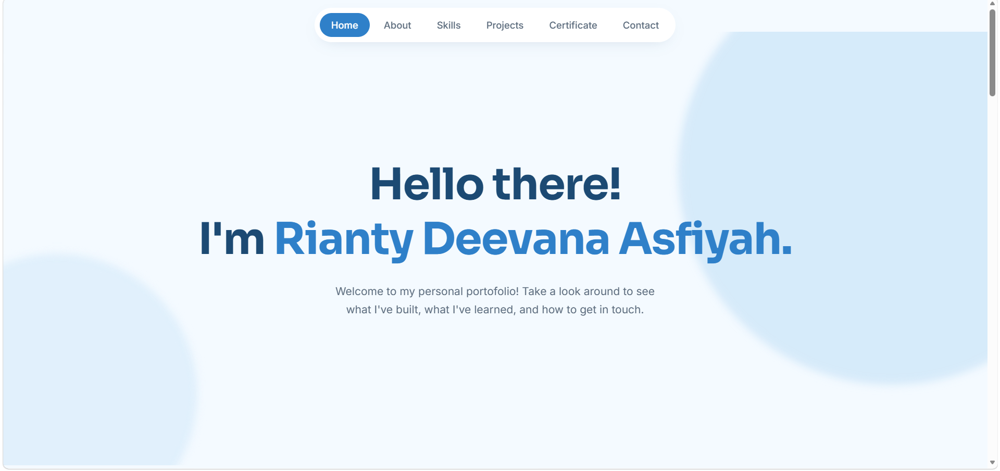
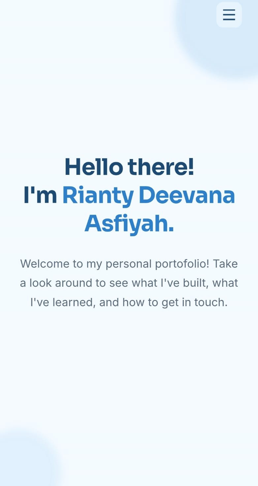

# Portofolio Website | Rianty Deevana Asfiyah 😃✨

Website portofolio pribadi yang dibuat untuk menampilkan informasi tentang diri saya, skill,
beberapa project, serta sertifikat yang saya miliki. Website ini dibuat menggunakan HTML, CSS,
dan JavaScript tanpa menggunakan framework. Desainnya dibuat sederhana dengan kombinasi warna
biru muda dan putih, ditambah animasi ringan agar tampilan website terasa lebih menarik saat digunakan.

<p align="center">
  
  
</p>

### Live Demo:
https://portofolio-riantydeeva.vercel.app/

## Fitur
- Navigasi melayang (floating pill nav) dengan highlight otomatis sesuai section yang sedang dilihat
- Menu hamburger untuk tampilan mobile
- Animasi fade-in saat elemen muncul di layar (scroll reveal)
- Section About, Skills, Projects, dan Certificate
- Tampilan responsif untuk berbagai ukuran layar, mulai dari HP hingga desktop

## Teknologi yang Digunakan
- HTML5 — digunakan untuk membuat struktur dan isi halaman
- CSS3 — digunakan untuk mengatur tampilan, layout, animasi, dan responsive design
- JavaScript — digunakan untuk membuat interaksi seperti menu mobile, navigasi, dan scroll reveal
- Google Fonts — menggunakan font Sora untuk heading dan Inter untuk teks
- Vercel — digunakan untuk hosting dan deployment website

## Cara Menjalankan
Karena ini website statis, tidak perlu instalasi atau build process apa pun.
### 1. Langsung diakses online
Website dapat langsung dibuka melalui: https://portofolio-riantydeeva.vercel.app/
### 2. Dijalankan secara lokal
```bash
git clone https://github.com/riantydeeva/portofolio-riantydeeva.git
cd portofolio-riantydeeva
```
Setelah itu buka `index.html` di browser. Atau, jika menggunakan VS Code, project dapat dijalankan menggunakan ekstensi **Live Server**.

## Deployment
Website ini di-deploy menggunakan **Vercel**. Repository dihubungkan dengan Vercel
sehingga setiap perubahan yang di-push ke branch utama akan otomatis di-deploy kembali.

## Kontak
Untuk informasi lebih lanjut, silakan hubungi saya melalui email atau media sosial yang tersedia pada bagian **Contact** di website.
